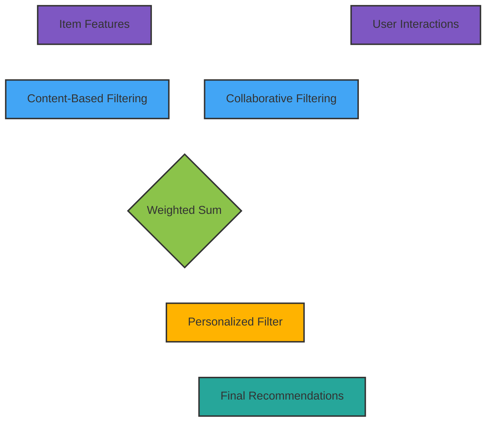

# Project: Harmonics - Specifications

## Table of Contents

### Backend Apps

- Analytics
- Api
- Authentication
- Content
- Engine
- Room
- Studio
- User

### Frontent Apps

- Frontend
- Studio frontend

### Analytics

- **Models**: Content Data
- **Serializers**: AnalyticsSerializer

### Api

- **Models**: Playlist
- **ExtraModels**: PlaylistSong, PlaylistCollaborator
- **Serializers**: Song, Artist, Album, Content Interaction, Playlist, User Library, User History, Grouped Feed
- **Views**: Retrieve Artist, Song, Album, Create Interaction, Delete Interaction, Toggle Interaction, Playlist, Playlist List, Create Playlist, Update Playlist, Destroy Playlist, User Feed, User History, User Library, Create User Library, User, Create User, Search

### Authentication

- **Authentication**: Cookie JWT Authentication

### Content

- **Models**: Song, Artist, Album, Genre, Version
- **ExtraModels**: SongVersion, ArtistGenre, GenreSong, ArtistSong, AlbumSong, AlbumArtist
- **Serializers**: Genre, Song, Album, Artist

### Engine

- **Models**: Content Features, Group
- **Serializers**: Content Features, Group
- **Signals**:
- **Engine**:

### Room

- **Models**: Room, Room Users

### Studio

- **Models**: Song Owner, Album Owner, Artist Owner
- **Serializers**: Artist, Song, Album
- **Views**: CRUD Song, CRUD Artist, CRUD Album

### User

- **Models**: UserData, UserHistory, UserLibrary, UserFeed, UserContentInteraction
- **Serializers**: CRU User

## API Endpoints

**1. User authentication:**
| URLs | Description | url Location | View Class |
|:-----|:------------|:-------------|:-----------|
|**POST** /auth/login/|Login with credentials.|backend/|authentication.LoginView|
|**POST** /auth/refersh/|Refresh the TOKEN|backend/|authentication.RefeshView|
|**POST** /auth/logout/|Logout the user|backend/|authentication.LogoutView|

**2. User Profile**
| URLs | Description | url Location | View Class |
|:-----|:------------|:-------------|:-----------|
|**GET** /api/profile/|Get profile data.|api/|api.UserView|
|**POST** /api/user/create/|Create/Register User.|api/|api.CreateUserView|
|**PUT** /api/user/update/|Update user profile details.|api/|api.UpdateUserView|

**3. User Content**
| URLs | Description | url Location | View Class |
|:-----|:------------|:-------------|:-----------|
|**GET** /api/feed/|Retrieve personalized music feed.|api/|api.UserFeedView|
|**GET** /api/feed/?group=""&limit=""|Retrieve personalized music feed with given group names and/or limit.|api/|api.UserFeedView|
|**GET** /api/playlist/list/|Retrieve list of owned playlists.|api/|api.PlaylistListView|
|**GET** /api/explore/|Retrieve new content.|api/|...|
|**POST** /api/library/create/|Create UserLibrary items|api/|api.CreateLibraryView|
|**GET** /api/library/|Get UserLibrary items|api/|api.LibraryView|
|**POST** /api/history/create/|Create UserHistory items|api/|api.CreateHistoryView|
|**GET** /api/history/|Get History items|api/|api.HistoryView|
|**POST** /api/interact/toggle|Toggle User Content Interaction for Like, Dislike and Save|api/|api.ToggleInteractView|

**4. Content**
| URLs | Description | url Location | View Class |
|:-----|:------------|:-------------|:-----------|
|**GET** /api/song/`<pubilc_id>`/|Retrieve song details.|api/|api.SongView|
|**GET** /api/album/`<public_id>`/|Retrieve album details.|api/|api.AlbumView|
|**GET** /api/artist/`<public_id>`/|Retrieve artist details.|api/|api.ArtistView|
|**GET** /api/playlist/`<playlist_id>`/|Retrieve playlist details.|api/|api.PlaylistView|
|**GET** /api/search/?q=" "|Search for content.|api/|api.SearchView|

**5. Playlist Update**
| URLs | Description | url Location | View Class |
|:-----|:------------|:-------------|:-----------|
|**POST** /api/playlist/create/|Create a new playlist.|api/|api.CreatePlaylistView|
|**PUT** /api/playlists/`<id>`/update/|Update playlist details.|api/|api.UpdatePlaylistView|
|**DELETE** /api/playlists/`<id>`/delete/|Delete a playlist.|api/|api.DestroyPlaylistView|

**6. Studio Update**
| URLs | Description | url Location | View Class |
|:-----|:------------|:-------------|:-----------|
|**POST** /studio/song/create/|Create Song Item.|studio/|studio.CreateSongView|
|**GET** /studio/song/`<public_id>`/|Retrieve Album Item.|studio/|studio.SongView|
|**PUT** /studio/song/`<public_id>`/update/|Update Song Item.|studio/|studio.UpdateSongView|
|**DELETE** /studio/song/`<public_id>`/delete/|Delete Song Item.|studio/|studio.DestroySongView|
|**POST** /studio/album/create/|Create Album Item.|studio/|studio.CreateAlbumView|
|**GET** /studio/album/`<public_id>`/|Retrieve Album Item.|studio/|studio.AlbumView|
|**PUT** /studio/album/`<public_id>`/update/|Update Album Item.|studio/|studio.UpdateAlbumView|
|**DELETE** /studio/album/`<public_id>`/delete/|Delete Album Item.|studio/|studio.DestroyAlbumView|
|**POST** /studio/artist/create/|Create Artist Item.|studio/|studio.CreateArtistView|
|**GET** /studio/artist/`<public_id>`/|Retrieve Artist Item.|studio/|studio.ArtistView|
|**PUT** /studio/artist/`<public_id>`/update/|Update Artist Item.|studio/|studio.UpdateArtistView|
|**DELETE** /studio/artist/`<public_id>`/delete/|Delete Artist Item.|studio/|studio.DestroyArtistView|

## Hybrid Music Recommendation System Diagram

